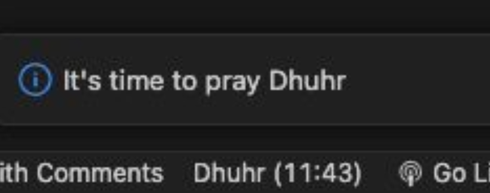

# IBADAH

The Ibadah plugin for VSCode can show Muslim prayer time at the status bar and popup notification. Fully customizable.

## Features

- Notifications
  

## Commands

- Ibadah: Pray Configure
  > Open the settings and config
- Ibadah: Pray Refresh
  > Refresh the extension to get the latest config values

## Extension Settings

- Default settings

  ```typescript
  "ibadah.pray": {
    "country": "Indonesia",
    "city": "Surabaya",
    "notification": {
      "before": 15, // The notification will show before the actual time, in minutes.
      "message": "It's time to pray {pray}" // The {pray} will replaced with the actual pray time. Customizable with the names below.
    },
    "names": {
      "Fajr": "Fajr",
      "Dhuhr": "Dhuhr",
      "Asr": "Asr",
      "Maghrib": "Maghrib",
      "Isha": "Isha"
    }
  }
  ```

## Thanks to

- [Aladhan](https://aladhan.com/)
- [Flaticon](https://www.flaticon.com/free-icons/islam)
